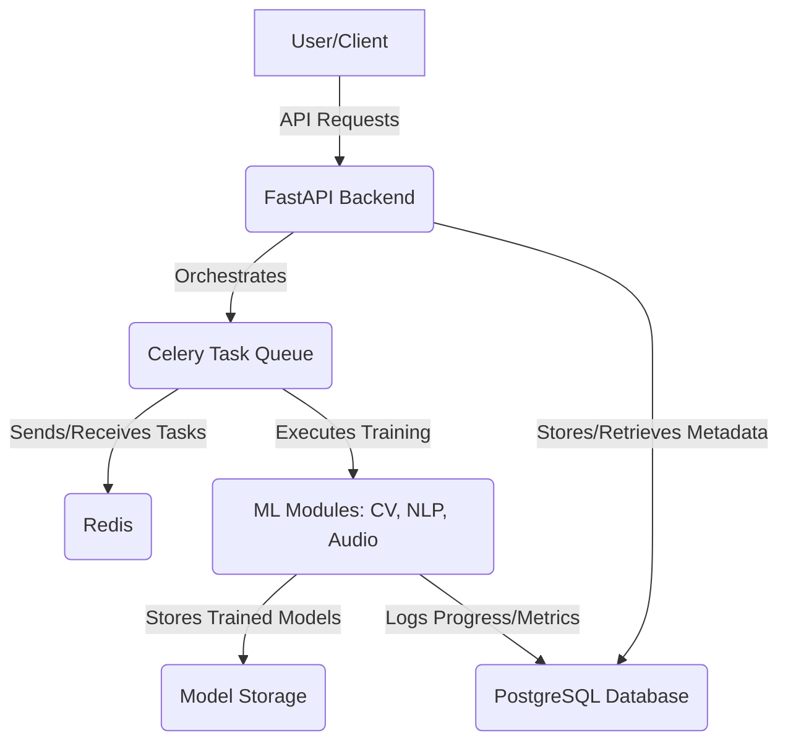

# Project Plan: Field Hockey Module Training Application

## 1. Introduction

This document outlines the detailed plan for developing a dedicated application for training machine learning modules used in the Field Hockey Broadcasting Platform. The primary goal is to create a robust, scalable, and user-friendly system for managing and executing training workflows for various ML models (Computer Vision, NLP, Audio Processing).

## 2. Core Requirements

-   **Data Ingestion**: Ability to upload and manage diverse datasets (video, audio, annotations).
-   **Training Orchestration**: Initiate, monitor, and manage ML training jobs.
-   **Model Management**: Store, version, and retrieve trained models.
-   **API-driven**: Provide a clear API for interaction.
-   **Extensible**: Easily integrate new ML models and training pipelines.
-   **Open Source**: All developed modules and components must be open-source compatible.
-   **Unified Deployment**: The application should be designed for eventual deployment as a single, unified application or easily hosted components.

## 3. Architecture Overview

The application will follow a microservices-oriented architecture, with a clear separation of concerns. All components will leverage open-source technologies to ensure flexibility and future deployability.

-   **FastAPI Backend**: The core API layer, handling requests, data validation, and orchestrating training tasks. (Open-source: Python, FastAPI)
-   **Celery Task Queue**: For asynchronous and long-running training jobs. (Open-source: Celery)
-   **Redis**: Message broker for Celery and caching. (Open-source: Redis)
-   **PostgreSQL**: Relational database for storing metadata about training jobs, datasets, and models. (Open-source: PostgreSQL)
-   **ML Modules**: Separate Python packages/modules for specific ML functionalities (CV, NLP, Audio), allowing for modular development and easy integration. These will primarily utilize open-source ML frameworks (e.g., PyTorch, Hugging Face Transformers, OpenCV).



## 4. Detailed Plan & Algorithms

### 4.1. Data Ingestion

-   **Endpoint**: `POST /api/v1/training/upload-data`
-   **Algorithm**:
    1.  Receive uploaded file (video, audio, JSON annotation).
    2.  Validate file type and content.
    3.  Store raw data in a designated data storage location (e.g., `platform/data/raw_videos`, `platform/data/annotations`).
    4.  Record metadata (filename, type, upload time) in PostgreSQL.
    5.  (Future) Trigger preprocessing tasks if necessary (e.g., video frame extraction).

### 4.2. Training Job Orchestration

-   **Endpoint**: `POST /api/v1/training/train-model`
-   **Algorithm**:
    1.  Receive training request (e.g., model type, dataset ID, hyperparameters).
    2.  Validate request parameters.
    3.  Create a new training job entry in PostgreSQL with `PENDING` status.
    4.  Dispatch a Celery task (`train_model_task`) with job details.
    5.  Return `task_id` to the client.

-   **Endpoint**: `GET /api/v1/training/training-status/{task_id}`
-   **Algorithm**:
    1.  Retrieve task status from Celery using `task_id`.
    2.  Query PostgreSQL for additional job metadata.
    3.  Return combined status (PENDING, PROGRESS, SUCCESS, FAILURE) and relevant metrics/logs.

### 4.3. ML Modules (Placeholder & Integration)

-   **Structure**: Each ML domain (CV, NLP, Audio) will have its own Python package within `platform/backend/` (e.g., `cv_models`, `nlp_models`, `audio_models`).
-   **Training Function**: Each module will expose a `train` function that takes data paths and hyperparameters, and returns a trained model artifact and training metrics.
-   **Celery Task (`train_model_task`) Algorithm**:
    1.  Retrieve job details from the task arguments.
    2.  Load data based on dataset ID.
    3.  Dynamically import and call the appropriate ML module's `train` function.
    4.  Update Celery task state (`PROGRESS`) periodically.
    5.  Save trained model artifact to storage (e.g., `platform/backend/models/trained`).
    6.  Update training job status (`SUCCESS`/`FAILURE`) and store metrics/logs in PostgreSQL.

## 5. High-Level Flowchart

```mermaid
flowchart TD
    A[Start]
    A --> B{User Action}

    B -- Upload Data --> C[Call /upload-data API]
    C --> D{Validate & Store Data}
    D --> E[Update DB Metadata]
    E --> F[Data Upload Complete]

    B -- Start Training --> G[Call /train-model API]
    G --> H[Create DB Job Entry (PENDING)]
    H --> I[Dispatch Celery Task]
    I --> J[Return Task ID]

    I --> K{Celery Worker Picks Up Task}
    K --> L[Load Data & ML Module]
    L --> M[Execute Training (Update PROGRESS)]
    M --> N{Training Complete?}
    N -- Yes --> O[Save Model & Update DB (SUCCESS)]
    N -- No --> P[Update DB (FAILURE)]
    O --> Q[End]
    P --> Q

    B -- Check Status --> R[Call /training-status/{task_id} API]
    R --> S[Query Celery & DB]
    S --> T[Return Status & Metrics]
    T --> Q
```

## 6. Next Steps (Implementation Phases)

1.  **Phase 1: Core Backend Setup & Basic Endpoints**
    -   Ensure FastAPI, PostgreSQL, Redis, and Celery are correctly configured and communicating.
    -   Implement `/upload-data` endpoint for annotations (JSON) and basic file storage.
    -   Implement `/train-model` endpoint to dispatch a dummy Celery task.
    -   Implement `/training-status/{task_id}` to retrieve Celery task state.

2.  **Phase 2: Data Management & Preprocessing**
    -   Enhance data upload to handle video/audio files more robustly.
    -   Implement basic data validation and error handling.
    -   Set up a simple local file storage mechanism for uploaded data.

3.  **Phase 3: ML Module Integration (Iterative)**
    -   Start with one ML module (e.g., `cv_models`).
    -   Replace dummy training logic with actual PyTorch/TensorFlow code.
    -   Implement model saving and loading within the Celery task.
    -   Add basic metrics tracking for training runs.

4.  **Phase 4: Advanced Features (Future Iterations)**
    -   Model versioning and rollback.
    -   User authentication and authorization.
    -   More sophisticated monitoring and logging.
    -   Integration with cloud storage (S3, GCS).
    -   Web-based UI for managing training jobs.


now::
1. Solution Overview
You want a web UI that:

Loads a YouTube field hockey video.
Allows manual annotation of the field boundary (bounding box and angle).
Supports manual correction of boundaries, ball tracking, player movement, and space occupation (as a 3D “cube”).
Stores all annotation data in a relational database using SCD Type 2 (for historical tracking).
Enables future 3D virtual replay (like FIFA’s offside/VAR system).
Is simple for annotators, but stores data in a way that supports analytics and 3D reconstruction.
Leverages best practices and open-source projects.
2. Implementation Plan
A. Web UI Features
YouTube Video Loader: Paste a YouTube link, load the video in the UI.
Annotation Tools:
Draw/edit field boundary (rectangle or polygon, with angle).
Draw bounding boxes for players, ball, and other objects.
Track ball and player movement frame-by-frame.
Mark “space occupied” as a 3D region (cube/prism) per frame or sequence.
Manual Correction: Edit any annotation, boundary, or trajectory.
Data Export/Import: Save/load annotations in a structured format.
3D Preview: (Optional, advanced) Visualize the annotated data as a 3D field.
B. Backend Features
Relational DB Schema: Store all annotation data with SCD Type 2 (track changes over time).
API Endpoints: For saving/loading annotations, querying analytics, and supporting the UI.
Analytics Support: Provide endpoints for analytics queries (e.g., player heatmaps, ball possession).
C. Open-Source Research & Best Practices
Use open-source annotation tools as a base (e.g., CVAT, Label Studio, MakeSense.ai, VIA).
Use libraries like react-player for YouTube, react-konva or fabric.js for drawing, and three.js for 3D visualization.
For SCD Type 2, use SQLAlchemy models with versioning (or a library like SQLAlchemy-Continuum).
3. Next Steps
Step 1: Scaffold the UI
Create a new React page/component for annotation.
Integrate YouTube video playback.
Add a canvas overlay for drawing/editing boundaries and boxes.
Step 2: Design the DB Schema
Define tables for videos, frames, objects, boundaries, and SCD Type 2 versioning.
Step 3: Implement API Endpoints
Endpoints for saving/loading annotations, querying history, and analytics.
Step 4: Integrate Drawing & Correction Tools
Use react-konva or similar for 2D annotation.
Add controls for manual correction and 3D region marking.
Step 5: (Optional) 3D Visualization
Use three.js to render a virtual field and replay annotated events.
Step 6: Documentation & Analytics
Update documentation in project_status.
Provide usage instructions and analytics API docs.
4. Immediate Action
